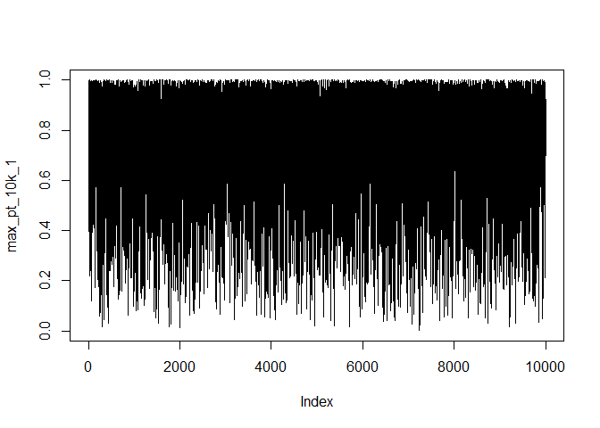
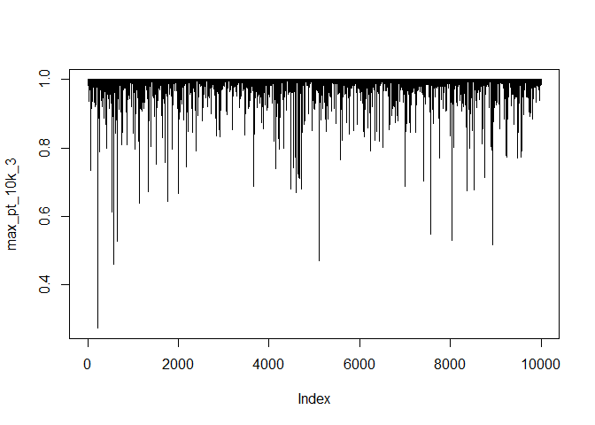

Week 2 lab
================
Haojia Li
1/27/23

``` r
rar_func <- function(N = 228, interim = 40, trt_effect, rar = T, print_text = T) {
  # name arms
  ctrl <- "ctrl"
  trts <- paste0("arm", 1:3)
  arms <- c(ctrl, trts)
  sim_suct_postdist <- function(n, alloc_prob = rep(0.25,4)) {
    # number of participants to be allocated to each arm
    nt <- round(n*alloc_prob)
    # simulate success/fail by treatment effect
    yt <- mapply(rbinom, nt, 1, trt_effect, SIMPLIFY = F)
    names(nt) <- names(yt) <- arms
    # calculate number of success in each arm
    suct <- sapply(yt, sum)
    # posterior distribution matrix, K = 1000
    post_dist_mat <- mapply(rbeta, 1000, trt_effect + suct, 1 - trt_effect + nt - suct)
    colnames(post_dist_mat) <- arms
    res <- list(`Num. of Patients` = nt, `Num. of Success` = suct, `Posterior Dist.` = post_dist_mat)
    return(res)
  }
  # posterior distribution matrix based on equally allocated patients
  suct_postdist_equal <- sim_suct_postdist(ifelse(rar, interim, N))
  if(!rar) {
    # total number of patients in each arm
    Nt <- suct_postdist_equal$`Num. of Patients`
    # total number of success in each arm
    SUCt <- suct_postdist_equal$`Num. of Success`
    post_dist_final <- suct_postdist_equal$`Posterior Dist.`
  } else {
    # initial total number of patients in each arm after 1st interim analysis
    nt <- Nt <- suct_postdist_equal$`Num. of Patients`
    # initial total number of success in each arm after 1st interim analysis
    suct <- SUCt <- suct_postdist_equal$`Num. of Success`
    post_dist_interim <- suct_postdist_equal$`Posterior Dist.`
    # number of patients that have been allocated
    nn <- interim
    # realloc_prob <- calc_realloc_prob(post_dist_interim)
    while(nn < N){
      # ---- 1. re-normalize allocation probabilities ----
      # the arm drawn to be the largest
      best_arm <- factor(apply(post_dist_interim, 1, which.max), levels = 1:4, labels = arms)
      # frequency of arms to be the largest
      vt <- table(best_arm)/1000
      vt[ctrl] <- min(c(sum(vt[trts] * (nt[trts]+1) / (nt[ctrl]+1)), max(vt[trts])))
      # ---- 2. start new interim analysis ----
      interim <- min(interim, N-nn)
      nn <- nn + interim
      # use normalized vt as the allocation probability
      suct_postdist_interim <- sim_suct_postdist(interim, vt/sum(vt))
      nt <- suct_postdist_interim$`Num. of Patients`; Nt <- Nt + nt
      suct <- suct_postdist_equal$`Num. of Success`; SUCt <- SUCt + suct
      post_dist_interim <- suct_postdist_equal$`Posterior Dist.`
    }
    post_dist_final <- mapply(rbeta, 1000, trt_effect + SUCt, 1 - trt_effect + Nt - SUCt)
    colnames(post_dist_final) <- arms
  }
  # the probability that the best treatment arm is better than control
  max_pt <- mean(apply(post_dist_final[,trts], 1, max, na.rm = T) > post_dist_final[,ctrl])
  if(print_text) {
    design <- ifelse(rar, "response-adaptive randomization", "equal allocation")
    delta <- ifelse(rar, 0.9892, 0.9912)
    sucres <- ifelse(max_pt > delta, "successful", "failed")
    cat("The probability that the best treatment arm is better than control is:", formatC(max_pt, digits = 3, format = "f"), "\n")
    cat("Given the threshold of", delta, "under", design, "design, the trial is considered", sucres, "\n\n")
    cat("The number of patients allocated to each treatment arm is:\n")
    print(Nt)
  } else return(max_pt)
}
```

``` r
set.seed(7045)
rar_func(trt_effect = rep(0.35, 4))
```

    The probability that the best treatment arm is better than control is: 1.000 
    Given the threshold of 0.9892 under response-adaptive randomization design, the trial is considered successful 

    The number of patients allocated to each treatment arm is:
    ctrl arm1 arm2 arm3 
      90   24   90   24 

``` r
rar_func(trt_effect = rep(0.35, 4), rar = F)
```

    The probability that the best treatment arm is better than control is: 0.997 
    Given the threshold of 0.9912 under equal allocation design, the trial is considered successful 

    The number of patients allocated to each treatment arm is:
    ctrl arm1 arm2 arm3 
      57   57   57   57 

``` r
set.seed(7045)
max_pt_10k_1 <- replicate(10000, {rar_func(trt_effect = rep(0.35, 4), rar = F, print_text = F)})
plot(max_pt_10k_1, type = "l")
```



``` r
set.seed(7045)
rar_func(trt_effect = c(0.35,0.35,0.35,0.65))
```

    The probability that the best treatment arm is better than control is: 0.997 
    Given the threshold of 0.9892 under response-adaptive randomization design, the trial is considered successful 

    The number of patients allocated to each treatment arm is:
    ctrl arm1 arm2 arm3 
      99   10   24   99 

``` r
rar_func(trt_effect = c(0.35,0.35,0.35,0.65), rar = F)
```

    The probability that the best treatment arm is better than control is: 1.000 
    Given the threshold of 0.9912 under equal allocation design, the trial is considered successful 

    The number of patients allocated to each treatment arm is:
    ctrl arm1 arm2 arm3 
      57   57   57   57 

``` r
set.seed(7045)
max_pt_10k_3 <- replicate(10000, {rar_func(trt_effect = c(0.35,0.35,0.35,0.65), rar = F, print_text = F)})
plot(max_pt_10k_3, type = "l")
```


