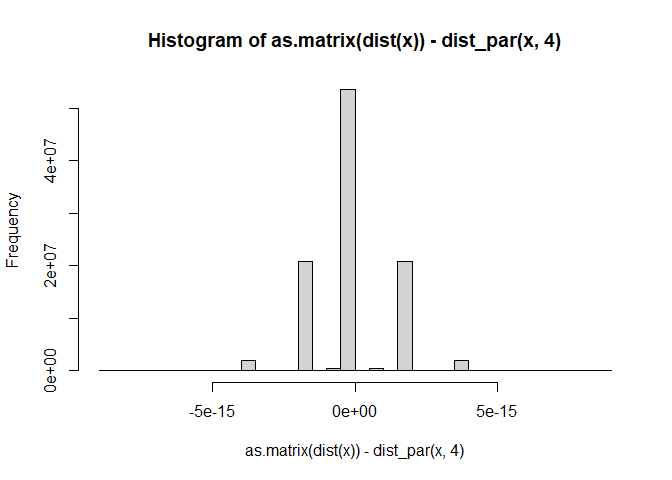
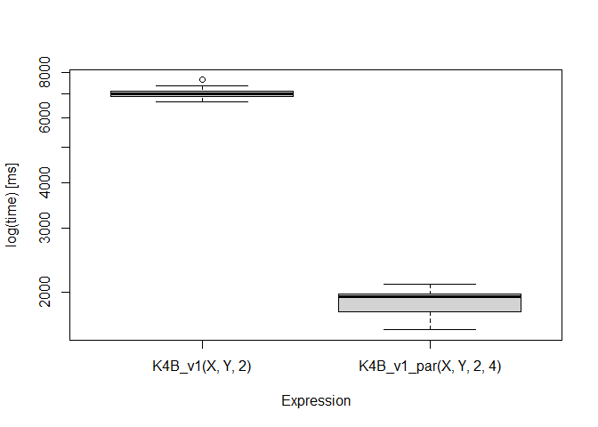

Lab 08 - RcppArmadillo + OpenMP + Slurm
================
Haojia Li
3/30/23

# Learning goals

- How we can use OpenMP to speed up loops.
- Submit a job (array) to Slurm.

# Lab task

We have the following C++ function that needs to be sped up:

``` rcpp
#include <RcppArmadillo.h>
// [[Rcpp::depends(RcppArmadillo)]]
using namespace Rcpp;

//' Fourth order biweight kernel
// [[Rcpp::export]]
arma::mat K4B_v1(
    arma::mat X,
    arma::mat Y,
    arma::vec h
) {
  
  arma::uword n_n = X.n_rows;
  arma::uword n_m = Y.n_cols;
  arma::mat Nhat(n_n, n_m);
  arma::vec Dhat(n_n);
  arma::mat Yhat(n_n, n_m);
  
  for (arma::uword i = 0; i < n_n; ++i)
  {
    
    const auto xrow_i = X.row(i);
    for (arma::uword j = 0; j < i; ++j)
    {
      
      arma::vec Dji_h = (X.row(j) - xrow_i) / h;
      auto Dji_h2 = arma::pow(Dji_h, 2.0);
      
      double Kji_h = prod(
        (arma::abs(Dji_h) < 1) %
          (1.0 - 3.0 * Dji_h2) %
          arma::pow(1.0 - Dji_h2, 2.0) * 105.0 / 64.0
      );
      
      Dhat(i) += Kji_h;
      Dhat(j) += Kji_h;
      
      Nhat.row(i) += Y.row(j) * Kji_h;
      Nhat.row(j) += Y.row(i) * Kji_h;
      
    }
    
  }
  
  for (size_t i = 0u; i < n_n; ++i)
  {
    if (Dhat(i) != 0)
      Yhat.row(i) = Nhat.row(i)/Dhat(i);
  }
  
  return(Yhat);
  
}
```

We will use OpenMP to accelerate the function.

# RcppArmadillo and OpenMP

<p style="text-align:center;color:white;font-size:200%;">
RcppArmadillo +
OpenMP<br>=<br>
</p>

- Friendlier than
  [**RcppParallel**](http://rcppcore.github.io/RcppParallel/)… at least
  for ‘I-use-Rcpp-but-don’t-actually-know-much-about-C++’ users (like
  myself!).

- Must run only ‘Thread-safe’ calls, so calling R within parallel blocks
  can cause problems (almost all the time).

- Use `arma` objects, e.g. `arma::mat`, `arma::vec`, etc. Or, if you are
  used to them `std::vector` objects as these are thread safe.

- Pseudo Random Number Generation is not very straight forward… But
  C++11 has a [nice set of
  functions](http://en.cppreference.com/w/cpp/numeric/random) that can
  be used together with OpenMP

- Need to think about how processors work, cache memory, etc. Otherwise
  you could get into trouble… if your code is slower when run in
  parallel, then you probably are facing [false
  sharing](https://software.intel.com/en-us/articles/avoiding-and-identifying-false-sharing-among-threads)

- If R crashes… try running R with a debugger (see [Section 4.3 in
  Writing R
  extensions](https://cran.r-project.org/doc/manuals/r-release/R-exts.html#Checking-memory-access)):

``` shell
~$ R --debugger=valgrind
```

## RcppArmadillo and OpenMP workflow

1.  Tell Rcpp that you need to include that in the compiler:

``` rcpp
#include <omp.h>
// [[Rcpp::plugins(openmp)]]
```

2.  Within your function, set the number of cores, e.g

``` rcpp
// Setting the cores
omp_set_num_threads(cores);
```

## RcppArmadillo and OpenMP workflow

3.  Tell the compiler that you’ll be running a block in parallel with
    OpenMP

``` rcpp
#pragma omp [directives] [options]
{
  ...your neat parallel code...
}
```

    You'll need to specify how OMP should handle the data:

    *   `shared`: Default, all threads access the same copy.
    *   `private`: Each thread has its own copy, uninitialized.
    *   `firstprivate` Each thread has its own copy, initialized.
    *   `lastprivate` Each thread has its own copy. The last value used is returned.


    Setting `default(none)` is a good practice.

3.  Compile!

## Ex 5: RcppArmadillo + OpenMP

Our own version of the `dist` function… but in parallel!

``` cpp
#include <omp.h>
#include <RcppArmadillo.h>
using namespace Rcpp;

// [[Rcpp::depends(RcppArmadillo)]]
// [[Rcpp::plugins(openmp)]]

// [[Rcpp::export]]
arma::mat dist_par(const arma::mat & X, int cores = 1) {
  
  // Some constants
  int N = (int) X.n_rows;
  int K = (int) X.n_cols;
  
  // Output
  arma::mat D(N,N);
  D.zeros(); // Filling with zeros
  
  // Setting the cores
  omp_set_num_threads(cores);
  
#pragma omp parallel for shared(D, N, K, X) default(none)
  for (int i=0; i < N; ++i)
  {
    
    for (int j=0; j < i; ++j)
    {
      
      // Computing the distance
      D.at(i,j) = std::sqrt(
        arma::sum(arma::pow(X.row(i) - X.row(j), 2.0))
      );
      
      // Computing square root
      D.at(j,i) = D.at(i,j);
      
    }
    
  }
    
  // My nice distance matrix
  return D;
  
}
```

The key lines:

- `#include <omp.h>` Includes the OpenMP library in our program.

- `// [[Rcpp::plugins(openmp)]]` Notifies `Rcpp::sourceCpp` we are using
  OpenMP.

- `omp_set_num_threads(cores)` Sets the number of cores.

- `#pragma omp parallel for...` Specifies the instruction.

Let’s see how much faster our function is

``` r
# Sourcing
Rcpp::sourceCpp("dist_par.cpp")

# Simulating data
set.seed(1231)
K <- 50
n <- 10000
x <- matrix(rnorm(n*K), ncol=K)
# Are we getting the same?
hist(as.matrix(dist(x)) - dist_par(x, 4)) # Only zeros
```



``` r
# Benchmarking!
bm <- microbenchmark::microbenchmark(
  dist(x),                 # stats::dist
  dist_par(x, cores = 1),  # 1 core
  dist_par(x, cores = 4),  # 4 cores
  dist_par(x, cores = 8),  # 8 cores
  times = 1
)

print(bm, unit = "s")
```

    Unit: seconds
                       expr      min       lq     mean   median       uq      max
                    dist(x) 8.940687 8.940687 8.940687 8.940687 8.940687 8.940687
     dist_par(x, cores = 1) 2.862029 2.862029 2.862029 2.862029 2.862029 2.862029
     dist_par(x, cores = 4) 1.527538 1.527538 1.527538 1.527538 1.527538 1.527538
     dist_par(x, cores = 8) 1.937317 1.937317 1.937317 1.937317 1.937317 1.937317
     neval
         1
         1
         1
         1

``` r
print(bm, unit = "relative")
```

    Unit: relative
                       expr      min       lq     mean   median       uq      max
                    dist(x) 5.853003 5.853003 5.853003 5.853003 5.853003 5.853003
     dist_par(x, cores = 1) 1.873621 1.873621 1.873621 1.873621 1.873621 1.873621
     dist_par(x, cores = 4) 1.000000 1.000000 1.000000 1.000000 1.000000 1.000000
     dist_par(x, cores = 8) 1.268260 1.268260 1.268260 1.268260 1.268260 1.268260
     neval
         1
         1
         1
         1

There’s more to `OpenMP`. I invite you to go over a set of experiments
where I compare different strategies of implementing the same function
here: <https://github.com/UofUEpiBio/r-parallel-benchmark>

Before continuing to the next section. Try to apply what we just learned
to include OpenMP the function `K4B_v1`.

# Submitting jobs to Slurm

We need to execute the following Rscript in CHPC[^1]:

``` r
library(Rcpp)

# Compiling
Rcpp::sourceCpp("distance.cpp", verbose = TRUE)

id <- as.integer(Sys.getenv("SLURM_ARRAY_TASK_ID", unset = "0"))
message("We are working in array #", id)

is_array <- ifelse(
  Sys.getenv("SLURM_ARRAY_TASK_ID", unset = "") == "",
  FALSE,
  TRUE
)

# Generating seeds
set.seed(123)

# Need to make sure all arrays have different seeds
if (is_array) {
  seeds <- as.integer(Sys.getenv("SLURM_ARRAY_TASK_COUNT", 1))
  seeds <- sample.int(.Machine$integer.max, seeds)
  set.seed(seeds[id])
}

n <- 500
Y <- matrix(rnorm(n * n), ncol = n)
X <- cbind(rnorm(n))

# Running the benchmark
res <- microbenchmark::microbenchmark(
  K4B_v1(X, Y, 2),
  K4B_v2(X, Y, 2, 4),
  check = "equal", times = 10
)

print(res, unit = "relative")
print(res, unit = "ms")

png(
  ifelse(
    is_array,
    sprintf("openmp-example-%02i.png", id),
    "openmp-exampl.png"
    )
)
boxplot(res, unit = "ms")
dev.off()
```

``` rcpp
#include <omp.h>
#include <RcppArmadillo.h>
using namespace Rcpp;

// [[Rcpp::depends(RcppArmadillo)]]
// [[Rcpp::plugins(openmp)]]

// [[Rcpp::export]]
arma::mat K4B_v1_par(
    arma::mat X,
    arma::mat Y,
    arma::vec h,
    int cores = 1
) {
  
  arma::uword n_n = X.n_rows;
  arma::uword n_m = Y.n_cols;
  arma::mat Nhat(n_n, n_m);
  arma::vec Dhat(n_n);
  arma::mat Yhat(n_n, n_m);
  
  // Setting the cores
  omp_set_num_threads(cores);
  
#pragma omp parallel for shared(X, Y, h, n_n, n_m, Nhat, Dhat, Yhat) default(none)

  for (arma::uword i = 0; i < n_n; ++i)
  {
    
    const auto xrow_i = X.row(i);
    for (arma::uword j = 0; j < n_n; ++j)
    {
      
      if(i == j)
        continue;
      
      arma::vec Dji_h = (X.row(j) - xrow_i) / h;
      auto Dji_h2 = arma::pow(Dji_h, 2.0);
      
      double Kji_h = prod(
        (arma::abs(Dji_h) < 1) %
          (1.0 - 3.0 * Dji_h2) %
          arma::pow(1.0 - Dji_h2, 2.0) * 105.0 / 64.0
      );
      
      Dhat(i) += Kji_h;
      // Dhat(j) += Kji_h;
      
      Nhat.row(i) += Y.row(j) * Kji_h;
      // Nhat.row(j) += Y.row(i) * Kji_h;
      
    }
    
  }
  
  for (size_t i = 0u; i < n_n; ++i)
  {
    if (Dhat(i) != 0)
      Yhat.row(i) = Nhat.row(i)/Dhat(i);
  }
  
  return(Yhat);
  
}
```

``` r
set.seed(1231)
n <- 1000

Y <- matrix(rnorm(n * n), ncol = n)
X <- cbind(rnorm(n))
# h <- K4B_v1_par(X, Y, 2)

res <- microbenchmark::microbenchmark(
  K4B_v1(X, Y, 2),
  K4B_v1_par(X, Y, 2, 4),
  check = "equal",
  times = 10
  )

boxplot(res, unit = "ms")
print(res, unit = "relative")
```



    Unit: relative
                       expr      min       lq     mean   median       uq     max
            K4B_v1(X, Y, 2) 4.205986 3.869732 3.720133 3.581976 3.567756 3.60879
     K4B_v1_par(X, Y, 2, 4) 1.000000 1.000000 1.000000 1.000000 1.000000 1.00000
     neval cld
        10  a 
        10   b

Two ways of doing it: Single or multiple jobs (using job arrays.) To
submit the job, I have created two bash (slurm) scripts we can submit
with the `sbatch` function. Most of the time, we will be submitting
single jobs (time consuming operations, large memory, etc.) Job arrays
are useful when the entire script can be parallelized.

## Single job

The [`distance-job.slurm`](week-08/distance-job.slurm) contains the
following lines:

``` bash
#!/bin/sh
#SBATCH --job-name=rcpp-openmp-array
#SBATCH --account=vegayon-np
#SBATCH --partition=vegayon-shared-np
#SBATCH --ntasks=1
#SBATCH --cpus-per-task=4
#SBATCH --time=00:05:00
#SBATCH --output=slurmlog.log

# Loading R
module load R/4.2.2

#  Running the script
Rscript --vanilla distance.R
```

## Job array

The [`distance-job-array.slurm`](week-08/distance-job.slurm) contains
the following lines:

``` bash
#!/bin/sh
#SBATCH --job-name=rcpp-openmp-array
#SBATCH --account=vegayon-np
#SBATCH --partition=vegayon-shared-np
#SBATCH --ntasks=1
#SBATCH --cpus-per-task=4
#SBATCH --time=00:05:00
#SBATCH --output=slurmlog%a.log
#SBATCH --array=1-2

# Loading R
module load R/4.2.2

#  Running the script
Rscript --vanilla distance.R
```

[^1]: The `distance.R` R script can be downloaded
    [here](week-08/distance.R).
