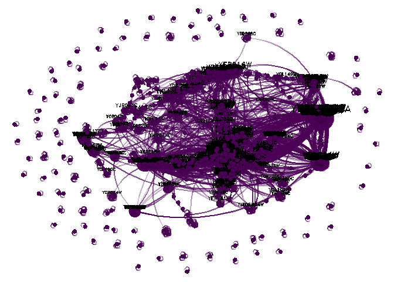
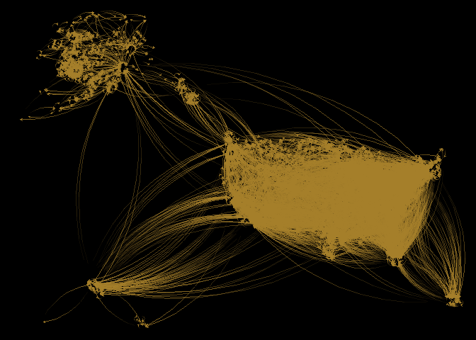

Lab 09 - Slurm practice
================
Haojia Li
4/6/23

# Learning goals

- Review of parallel computing
- Draw pretty networks with Slurm.

# Review of parallel computing

Regardless of R–and in the context of an HPC cluster–we have various
ways of parallelizing jobs:

1.  At the core level, using SIMD instructions.

2.  At the CPU level using multiple cores within a program (e.g.,
    loop-level).

3.  Same, but replicating the job within a node.

4.  At the node level, replicating the job across nodes.

## Task 1: Alternatives to job arrays

Besides job arrays in Slurm, look for an alternative way of replicating
jobs across multiple nodes (hint: There’s a type of `parallel::cluster`
object we haven’t discussed.) There are at least two.

## Task 2: Your expert opinion

Your expert opinion has been requested. For each way to parallelize a
job, provide: (i) a one-paragraph description, (ii) proposed criteria of
when to use it, and (iii) an example of an analysis that could be done
with it.

# Draw pretty networks with Slurm

Draw a pretty picture of the yeast network using the development version
of <a href="https://github.com/USCCANA/netplot"
target="_blank"><code>netplot</code></a>:

``` r
library(netplot)
library(igraph)
library(igraphdata)

data(yeast)

set.seed(889)

# Netplot objects are grobs (like ggplot2)
np <- nplot(
    yeast,
    # Too many vertices, so just a sample
    sample.edges = .1 
    )

# So we need to print them
print(np)
```



Read the manual of `nplot` and try:

1.  Coloring the vertices by the class `Class` attribute. You can access
    them using `V(yeast)$Class`.

2.  Playing with the layout, see igraph’s `?layout_`.

3.  Tryout `grid::patterns` for the vertices, see what you can do.

Create a design

## Task 1: Get the package

Install the package using `git clone` + `R CMD INSTALL` in the command
line.

## Task 2: First run

Try drawing one network with it. Use CHPC’s
<a href="https://ondemand.chpc.utah.edu"
target="_blank"><code>ondemand</code></a>.

``` r
# Loading the data
data(USairports, package="igraphdata")

# Generating a layout naively
layout   <- V(USairports)$Position
layout   <- do.call(rbind, lapply(layout, function(x) strsplit(x, " ")[[1]]))
layout[] <- stringr::str_remove(layout, "^[a-zA-Z]+")
layout   <- matrix(as.numeric(layout[]), ncol=2)

# Some missingness
layout[which(!complete.cases(layout)), ] <- apply(layout, 2, mean, na.rm=TRUE)

# Have to rotate it (it doesn't matter the origin)
layout <- netplot:::rotate(layout, c(0,0), pi/2)

# Simplifying the network
net <- simplify(USairports, edge.attr.comb = list(
  weight = "sum",
  name   = "concat",
  Passengers = "sum",
  "ignore"
))

# Pretty graph
nplot(
  net,
  layout            = layout,
  edge.width        = E(net)$Passengers,
  edge.color        = ~ ego(alpha = 0) + alter(col = "yellow", alpha = .75),
  skip.vertex       = TRUE,
  skip.arrows       = TRUE,
  edge.width.range  = c(.75, 4, 4), 
  bg.col            = "black",
  edge.line.breaks  = 10
  )
```



## Task 3: Submit to CHPC

Write an R and Slurm script to submit the job to CHPC. The job should
result in saving the `netplot` object to an RDS file and a png figure of
1024 x 780 px resolution.
